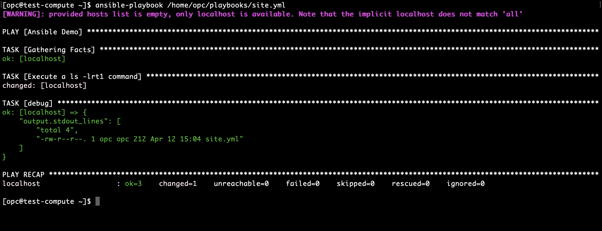

# oci-ansible-local
Deploy a compute instance into an existing subnet on OCI, and execute an Ansible task locally on the compute instance.

### Deployment via CLI Terraform

1. [Download this project](https://github.com/scacela/oci-ansible-local/archive/refs/heads/main.zip) to your local machine.
2. [Set up CLI Terraform on your local machine.](https://docs.oracle.com/en-us/iaas/Content/API/SDKDocs/terraformgetstarted.htm) 
3. Navigate to project folder on your local machine via CLI.
<pre>
cd YOUR_PATH_TO_THIS_PROJECT
</pre>
4. Open env.sh and edit the variables of prefix <b>TF_VAR_</b>, which will influence the stack topology according to your preferences. For the variable <b>TF_VAR_SUBNET_OCID</b>, be sure to assign the OCID of a subnet that <b>1.</b> allows public IPs, and <b>2.</b> has an associated Security List with a rule that allows inbound SSH, i.e. TCP ingress with all source ports open, and destination port 22 open.
<pre>
vi env.sh
</pre>
5. Export the <b>TF_VAR_</b> variables to the environment of the CLI instance.
<pre>
source env.sh
</pre>
6. Initialize your Terraform project, downloading necessary packages for the deployment.
<pre>
terraform init
</pre>
7. View the plan of the Terraform deployment, and confirm that the changes described in the plan reflect the changes you wish to make in your OCI environment.
<pre>
terraform plan
</pre>
8. Apply the changes described in the plan, and answer <b>yes</b> when prompted for confirmation.
<pre>
terraform apply
</pre>
9. You can track the logs associated with the job by monitoring the output on the CLI. Toward the end of the deployment, notice that the Ansible task has been run locally on the compute node during the Terraform deployment.

	
Terraform output showing Ansible local task execution

10. After the deployment has finished, you can access the compute instance using the public IP address and the SSH key that was generated for the compute instance.

11. Once you are logged into the compute instance, you can execute the Ansible local task manually.

	
Executing the Ansible local task manually

